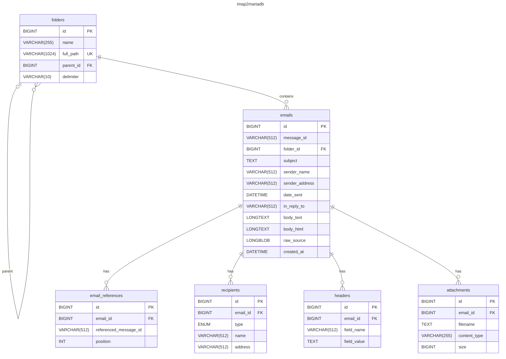

# Imap2MariaDB

Exports all emails from an IMAP account to a MariaDB database.

## Features

- IMAP connection with SSL/TLS support
- Export all folders or select specific folders
- Storage of **raw sources** ([RFC 822](https://datatracker.ietf.org/doc/html/rfc822)) of each email
- Extraction of **metadata**: Message-ID, subject, sender, sent date
- Extraction of **recipients** (From, To, Cc, Bcc, Reply-To) with names and addresses
- Extraction of **attachment list** with filename, MIME type and size
- Extraction of message **body** in plain text and HTML
- Duplicate detection based on Message-ID (incremental mode)
- Configurable batch processing
- Automatic decoding of MIME headers ([RFC 2047](https://datatracker.ietf.org/doc/html/rfc2047)) and character encodings

## Prerequisites

- Python 3.10+
- MariaDB or MySQL
- Python dependencies listed in `requirements.txt`

## Installation

### Clone the repository

```bash
git clone https://github.com/votre-utilisateur/Imap2MariaDB.git
cd Imap2MariaDB
```

### Create your virtual environment

You can create your virtual environment with Python:

**Under Linux or macOD:**

```bash
python3 -m venv .venv
```

**Under Windows:**

```powershell
python -m venv .venv
```

### Switch on your new virtual environment

**Under Linux or macOS:**

```bash
source .venv/bin/activate
```

**Under Windows:**

 - In **PowerShell**:
	```powershell
	.\.venv\Scripts\Activate.ps1
	```

 - In **Command Prompt**:
	```batch
	.venv\Scripts\activate.bat
	```
### Install libraries

You will need the Google Auth libraries. You can install them using **pip**:

```
pip install --require-virtualenv --requirement=requirements.txt
```

## Configuration

Copy the example configuration file and adapt it:

```bash
cp config.example.ini config.ini
```

Edit `config.ini` with your settings:

```ini
[imap]
host = imap.example.com
port = 993
ssl = true
user = user@example.com
password = your_password
# Folders to export (comma-separated). Empty = all folders.
folders =

[database]
host = localhost
port = 3306
user = root
password = your_db_password
database = imap2mariadb

[options]
batch_size = 100
skip_existing = true
```

### Database creation

The database must exist beforehand. Tables will be created automatically on first run.

```sql
CREATE DATABASE imap2mariadb CHARACTER SET utf8mb4 COLLATE utf8mb4_unicode_ci;
```

## Usage

```bash
# Standard run
python imap2mariadb.py

# With a custom configuration file
python imap2mariadb.py -c /path/to/config.ini

# Verbose mode
python imap2mariadb.py -v
```

## Database schema

### Entity Relationship Diagrams



### Table `folders`

Stores the IMAP folder tree. Each folder references its parent via `parent_id`, forming a hierarchy.

| Column    | Type          | Description                                     |
|-----------|---------------|-------------------------------------------------|
| id        | BIGINT        | Auto-increment primary key                      |
| name      | VARCHAR(255)  | Folder leaf name (e.g. `Subfolder`)             |
| full_path | VARCHAR(1024) | Full IMAP path (e.g. `INBOX/Subfolder`), unique |
| parent_id | BIGINT        | Reference to parent `folders.id` (NULL = root)  |
| delimiter | VARCHAR(10)   | IMAP hierarchy delimiter (e.g. `/` or `.`)      |

### Table `emails`

| Column         | Type         | Description                                      |
| -------------- | ------------ | ------------------------------------------------ |
| id             | BIGINT       | Auto-increment primary key                       |
| message_id     | VARCHAR(512) | Message-ID header                                |
| folder_id      | BIGINT       | Reference to `folders.id`                        |
| subject        | TEXT         | Message subject                                  |
| sender_name    | VARCHAR(512) | Sender name                                      |
| sender_address | VARCHAR(512) | Sender address                                   |
| date_sent      | DATETIME     | Sent date (UTC)                                  |
| in_reply_to    | VARCHAR(512) | Message-ID from the In-Reply-To header (indexed) |
| body_text      | LONGTEXT     | Plain text body                                  |
| body_html      | LONGTEXT     | HTML body                                        |
| raw_source     | LONGBLOB     | Complete raw source (RFC822)                     |
| created_at     | DATETIME     | Insertion date in database                       |

Threading relationships are stored as Message-ID strings, not as foreign keys
to `emails.id`. This means **deleting an email never cascades to related emails**
in the conversation thread. You can reconstruct threads by joining on
`emails.message_id = emails.in_reply_to` or via the `email_references` table.

### Table `email_references`

Stores the ordered list of Message-IDs from the `References` header. Each row
links a stored email to a referenced Message-ID, preserving the conversation chain.

| Column                | Type         | Description                                 |
|-----------------------|--------------|---------------------------------------------|
| id                    | BIGINT       | Auto-increment primary key                  |
| email_id              | BIGINT       | Reference to `emails.id` (CASCADE on delete)|
| referenced_message_id | VARCHAR(512) | Message-ID from the References header       |
| position              | INT          | 0-based position in the References chain    |

When an email record is deleted, its `email_references` rows are cascaded.
However, because `referenced_message_id` is a plain string (not a FK to
`emails.id`), **deleting an email does not affect other emails that reference
it or that it references**.

### Table `recipients`

| Column   | Type         | Description                             |
|----------|--------------|-----------------------------------------|
| id       | BIGINT       | Auto-increment primary key              |
| email_id | BIGINT       | Reference to `emails.id`                |
| type     | ENUM         | Type: From, To, Cc, Bcc, Reply-To       |
| name     | VARCHAR(512) | Recipient name                          |
| address  | VARCHAR(512) | Recipient email address                 |

### Table `headers`

Stores additional email headers not already managed in dedicated columns or
tables. Headers like Subject, From, To, Cc, Bcc, Reply-To, Date, Message-ID,
In-Reply-To and References are excluded (they are stored in their respective
columns/tables).

| Column      | Type         | Description                                          |
|-------------|--------------|------------------------------------------------------|
| id          | BIGINT       | Auto-increment primary key                           |
| email_id    | BIGINT       | Reference to `emails.id` (CASCADE on delete)         |
| field_name  | VARCHAR(512) | Header field name (e.g. `X-Mailer`, `DKIM-Signature`)|
| field_value | TEXT         | Decoded header value                                 |

### Table `attachments`

| Column      | Type         | Description                          |
|-------------|--------------|--------------------------------------|
| id          | BIGINT       | Auto-increment primary key           |
| email_id    | BIGINT       | Reference to `emails.id`             |
| filename    | TEXT         | Attached file name                   |
| content_type| VARCHAR(255) | MIME type (e.g. `application/pdf`)   |
| size        | BIGINT       | Size in bytes                        |

## License

See the [LICENSE](LICENSE) file.
